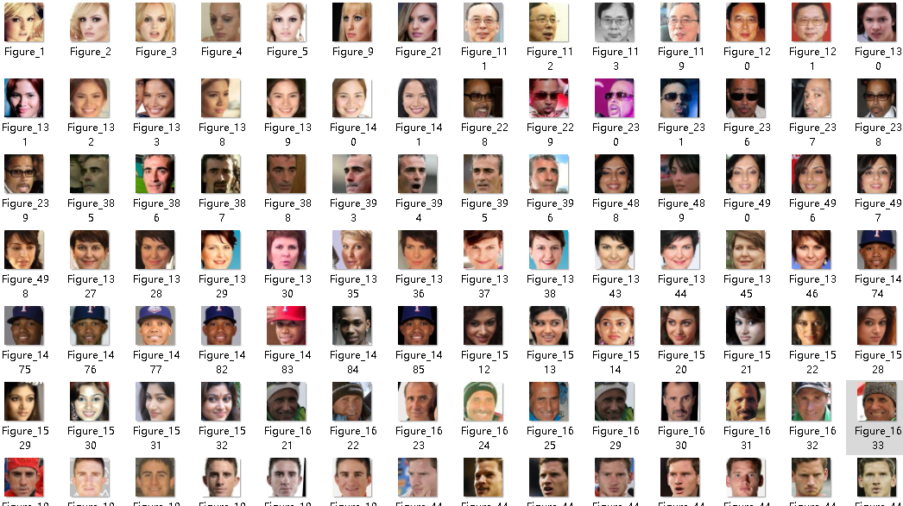
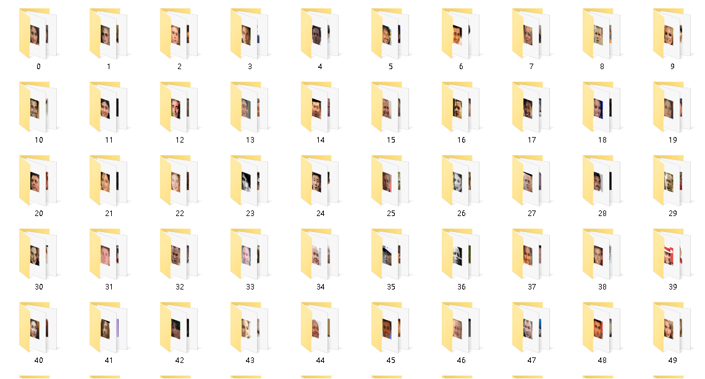
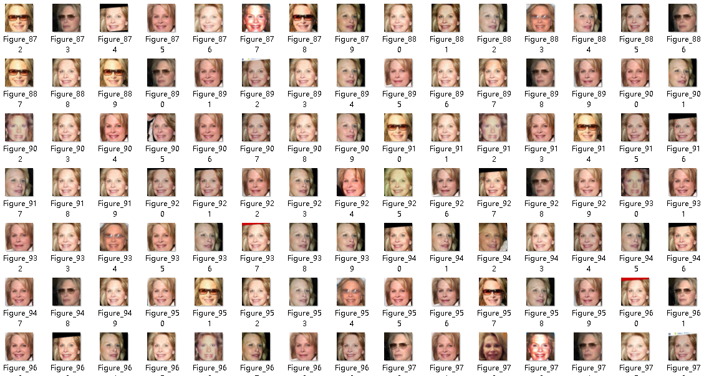
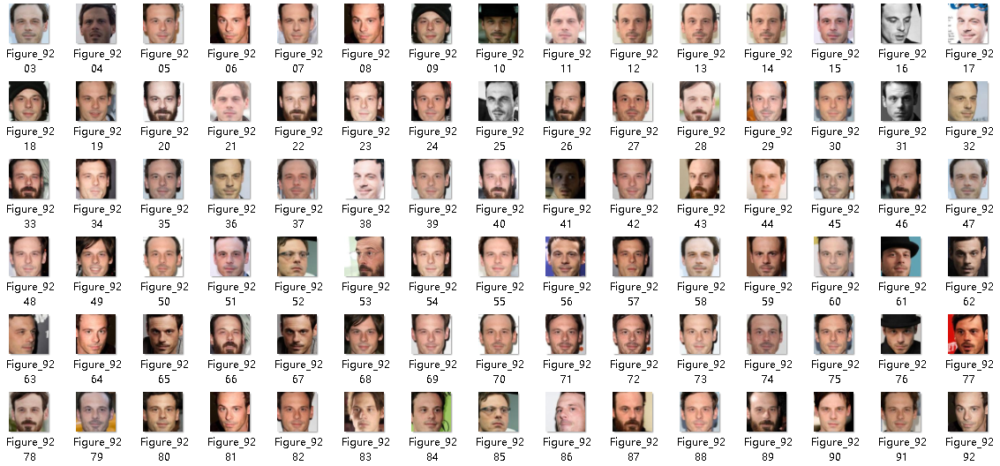
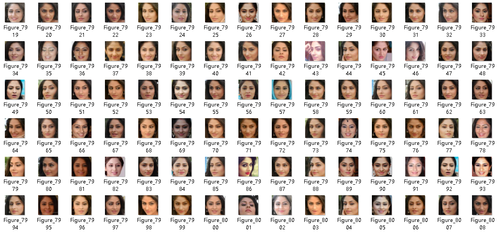

# Face Cluster Framework (人脸聚类框架)

English Version | [中文版](https://github.com/xiaoxiong74/face-cluster-framework/blob/master/README-zh.md)

## Intorduction

For a large number of given face images, face feature extraction component is used to extract face features,
and then face clustering model is used for face clustering and archiving.

## Requirements
* Python >= 3.6
* sklearn
* infomap
* numpy
* faiss-gpu(or faiss-cpu)
* torch >= 1.2
* torchvision

## Datasets and Pretrain_models

[download test data and pretrain model BaiduYun](https://pan.baidu.com/s/19Ho011j_ZpIT93aS1gSdrg)(passwd: trka)

Put face pictures in the file directory 'data/input_pictures/'. The format as follow:



Put the pretrain models in the file directory 'pretrain_models/'

```
'data_sample': all pictures in a file directory

'labeled_data_sample': this data you can evaluate the cluster result with set is_evaluate=True.

'pretrain_model': the feature extract pretraind model, you can retrain the model on your data(eg: masked face feature) with the method [hfsoftmax](https://github.com/yl-1993/hfsoftmax)
```

## Run

```bash
python main.py
```

## Results

The results in the file directory 'data/output_pictures' with default.



The output directory is constucted as follows:
```
.
├── data
|   ├── output_pictures
|   ├── ├── 0
|   |     |     └── 1.jpg
|   |     |     └── 2.jpg
|   |     |     └── 3.jpg
|   |     |     └── x.jpg
|   ├── ├── 1
|   |     |     └── 1.jpg
|   |     |     └── 2.jpg
|   |     |     └── 3.jpg
|   |     |     └── 4.jpg
|   ├── ├── ...
|   ├── ├── n
|   |     |     └── 1.jpg
|   |     |     └── 2.jpg
|   |     |     └── 3.jpg

all pictures in n file directory are the same person.
```






## Evaluate

If you want evaluate the cluster result, you should label and organize the input pictures like the data 'labeled_data_sample' with the format as follow:
```
.
├── data
|   ├── input_pictures
|   ├── ├── people_0
|   |     |     └── 1.jpg
|   |     |     └── 2.jpg
|   |     |     └── 3.jpg
|   |     |     └── x.jpg
|   ├── ├── people_2
|   |     |     └── 1.jpg
|   |     |     └── 2.jpg
|   |     |     └── 3.jpg
|   |     |     └── 4.jpg
|   ├── ├── ...
|   ├── ├── people_n
|   |     |     └── 1.jpg
|   |     |     └── 2.jpg
|   |     |     └── 3.jpg

all pictures in people_n file directory are the same person.

In addition, you should set is_evaluate=True.
```

## References

* [face-cluster](https://github.com/xiaoxiong74/face-cluster-by-infomap)
* [face_feature_extract](https://github.com/yl-1993/hfsoftmax)